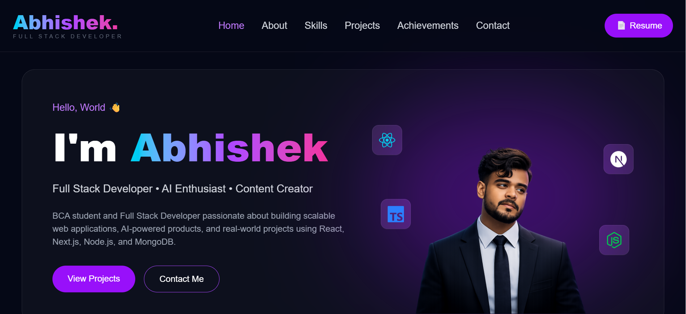
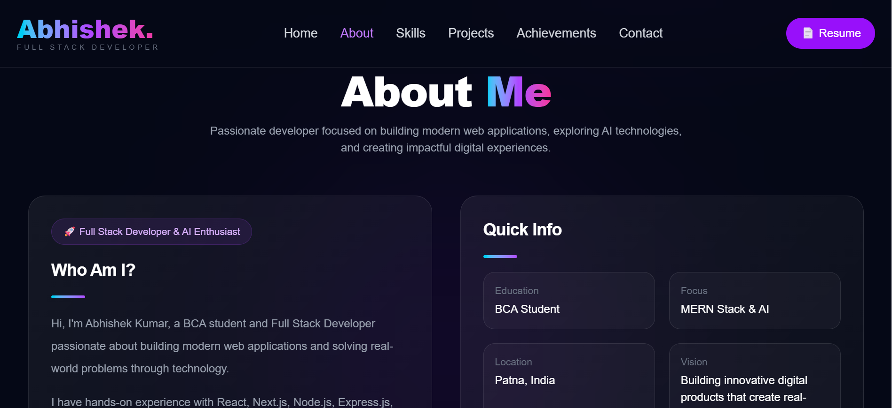
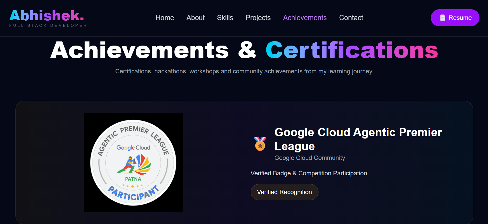

# Abhishek Kumar Portfolio 🚀

A modern and responsive developer portfolio built with Next.js, TypeScript, Tailwind CSS, and Framer Motion.

## 🌐 Live Demo

https://abhishek-portfolio-orcin-six.vercel.app/

## ✨ Features

* Modern UI Design
* Fully Responsive Layout
* Smooth Navigation
* Project Showcase
* Skills Section
* Achievements & Certifications
* Contact Information
* SEO Optimized Metadata
* Custom Favicon

## 🛠 Tech Stack

### Frontend

* Next.js
* TypeScript
* Tailwind CSS
* Framer Motion

### Deployment

* Vercel

## 📂 Sections

* Hero
* About Me
* Skills
* Projects
* Achievements
* Contact
* Footer

## Screenshots

## 🚀 Projects Featured

### TradeX

A full-stack stock trading platform inspired by Zerodha.

### IPL Akinator

AI-powered IPL player guessing game using dynamic questions and probability tracking.

### Personal Portfolio

Modern portfolio showcasing projects, skills, and achievements.

## 📬 Connect With Me

LinkedIn:
https://www.linkedin.com/in/abhishek-01-mern-dev/

GitHub:
https://github.com/Abhiyadav012

Email:
[abhisekyadav03017@gmail.com](mailto:abhisekyadav03017@gmail.com)

⚙️ Run Locally

Clone the project:

git clone https://github.com/Abhiyadav012/abhishek-portfolio.git

Go to the project directory:

cd abhishek-portfolio

Install dependencies:

npm install

Start development server:

npm run dev
📄 License

This project is open-source and available under the MIT License.

---

Built with ❤️ by Abhishek Kumar
